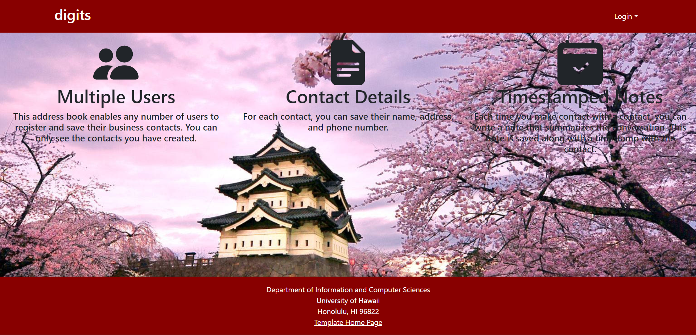
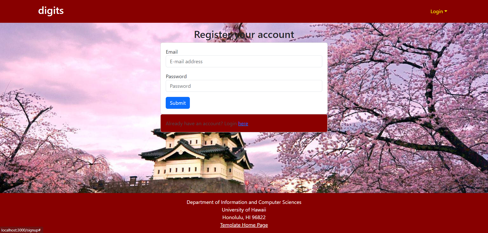
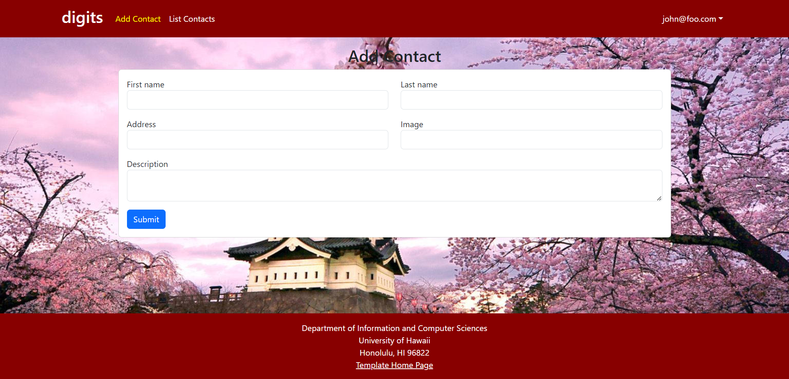
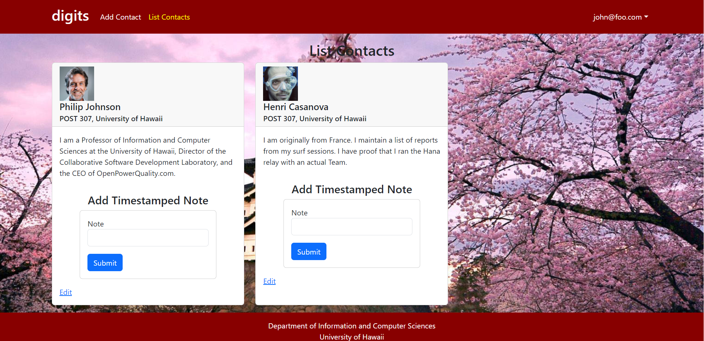
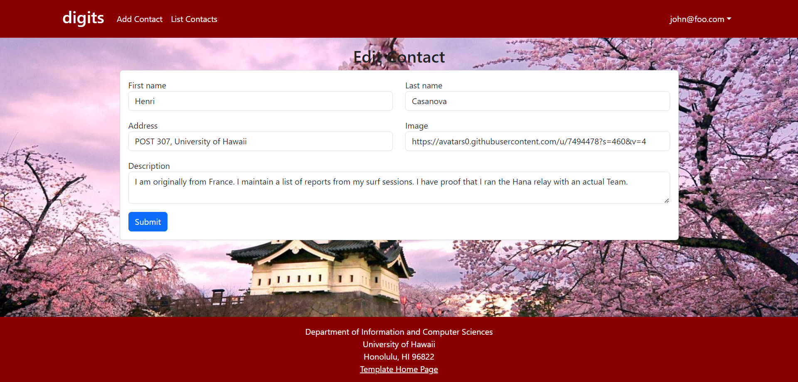
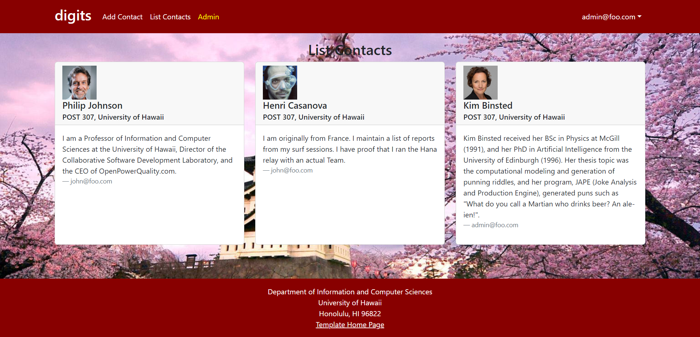

Digits is a simplified managing app that:

- Allows the creation of personalized accounts
- Create and manage contacts
- Add notes that are timestamped

## Installation

First, [install Meteor](https://www.meteor.com/install).

Second, download a copy of the [Digits repository](https://github.com/johnnyC808/digits). You may need to request access to this repository from the owner, as it is private.

Third, cd into the app directory and install the required libraries with:

```
$ meteor npm install
```

Once the libraries are installed, you can run the application by invoking:

```
$ meteor npm run start
```

The first time you run the app, it will create some default users and data. Here is the output:

```
 meteor npm run start 

> meteor-application-template-react@ start /Users/carletonmoore/GitHub/ICS314/meteor-application-template-react/app
> meteor --no-release-check --exclude-archs web.browser.legacy,web.cordova --settings ../config/settings.development.json

[[[[[ ~/GitHub/ICS314/meteor-application-template-react/app ]]]]]

=> Started proxy.                             
=> Started HMR server.                        
=> Started MongoDB.                           
I20220529-12:09:18.384(-10)? Creating the default user(s)
I20220529-12:09:18.389(-10)?   Creating user admin@foo.com.
I20220529-12:09:18.453(-10)?   Creating user john@foo.com.
I20220529-12:09:18.515(-10)? Creating default data.
I20220529-12:09:18.515(-10)?   Adding: Basket (john@foo.com)
I20220529-12:09:18.599(-10)?   Adding: Bicycle (john@foo.com)
I20220529-12:09:18.600(-10)?   Adding: Banana (admin@foo.com)
I20220529-12:09:18.601(-10)?   Adding: Boogie Board (admin@foo.com)
I20220529-12:09:18.773(-10)? Monti APM: completed instrumenting the app
=> Started your app.

=> App running at: http://localhost:3000/
```

You can verify that the code obeys our coding standards by running ESLint over the code in the imports/ directory with:

```
meteor npm run lint
```

## UI Walkthrough


#### Landing page

When you retrieve the app at http://localhost:3000, this is what should be displayed:


This page provides a brief description of the possible applications of this app.

#### Login page

Clicking on the Login link, then on the Sign In menu item displays this page:


#### Register page

Alternatively, clicking on the Login link, then on the Sign Up menu item displays this page:




#### Landing (after Login) page, non-Admin user

Once you log in (either to an existing account or by creating a new one), the navbar changes as follows:


You can now add new Contacts, and list the Contacts you have created. Note you cannot see any Contacts created by other users.

#### Add Contact

After logging in, here is the page that allows you to add new Contacts:



#### List Contacts

After logging in, here is the page that allows you to list all the Contacts you have created:



You click the "Edit" link to go to the Edit Contacts page, shown next.

#### Edit Contacts

After clicking on the "Edit" link associated with an item, this page displays that allows you to change and save it:



#### Landing (after Login), Admin user

You can define an "admin" user in the settings.json file. This user, after logging in, gets a special entry in the navbar:


#### Admin page (list all users contacts)

Admins are allowed a list of all the user's created contacts:



Note that non-admin users cannot get to this page, even if they type in the URL by hand.